# Block Memory Generator (BMG) IP Specifications

CNN Accelerator 에서 사용하는 모든 Block Memory Generator IP 의 Vivado customization 설정.
IP 재생성 / 새 팀원 onboarding / 인터페이스 충돌 디버깅 시 참조.

각 IP 의 Verilog port signature 와 engine 측 결선까지 명시. 변경 시 본 문서 최신화 필수.

> 📷 스크린샷(`<ip>/<ip>-<tab>.png`)은 **2026-06-02 최종 구성** 기준 (300MHz: 전 IP L=2; REGCEB 정책 — abrupt-stop[c2pool·poolfc·weight]=노출, conv-input[bram_input·c1c2]=미노출).

---

## 1. 전체 IP 목록 (한눈에)

| Component | Width A / B | Depth A / B | L | Byte Write | Primitive Output Reg | REGCEB Pin | 사용처 (write → read) |
|---|---|---|---|---|---|---|---|
| **`bram_c1_to_c2`** | 64 / 64 | 2048 / 2048 | 2 | ✓ (8-bit wea) | ✓ Enable | 미노출 (내부 tie 1) | Conv1 → Conv2 (ping-pong) |
| **`bram_c2_to_pool`** | 128 / 128 | 2048 / 2048 | 2 | ✗ (1-bit wea) | ✓ Enable | **✓ 노출 (engine 1 결선)** ★ | Conv2 → Maxpool (ping-pong). 300MHz 위해 L=1→L=2 + 출력 reg REGCEB 노출 (abrupt-stop p11, §3.4) |
| **`conv2_weight_bram`** | 32 / 32 | 1024 / 1024 | 2 | ✗ (1-bit wea) | ✓ Enable | ✓ 노출 (engine 에서 상수 1 결선) | PS → Conv2 weight |
| **`bram_input`** | **32 / 8** (asymmetric) | **512 / 2048** | **2** ★ | ✗ (1-bit wea) | **✓ Enable** ★ | 미노출 (내부 tie 1) | PS → Conv1 input image (ping-pong, 2 bank × 1024 byte). Port A = AXI burst 32-bit. Port B = Conv1 byte read. ★ 300MHz: L=1→L=2 (§6.2). |
| **`conv1_weight_bram`** | 32 / 32 | 64 / 64 | 2 | ✗ (1-bit wea) | ✓ Enable | ✓ 노출 (engine 에서 상수 1 결선) | PS → Conv1 weight |
| **`bram_pool_to_fc`** | 128 / 128 | 512 / 512 | **2** ★ | ✗ (1-bit wea) | **✓ Enable** | **✓ 노출 (engine 1 결선)** ★ | Maxpool → FC (ping-pong, 2 bank × 144 + padding). 300MHz 위해 L=1→L=2 + 출력 reg REGCEB 노출 (abrupt-stop sp143, §4.4) |
| **`fc_weight_bram`** | **512 / 512** | 1024 / 1024 | **2** ★ | **✓ (64-bit wea, byte size 8)** | **✓ Enable** | **✓ 노출 (engine 1 결선)** ★ | PS → FC weight (720 used). **1 word = 16ch × 32b SIMD-A (A=W1·2¹⁷+W0)**. Port A=512b 라 **512-bit AXI BRAM Ctrl + 32→512 datawidth converter** 필요. firmware 는 **11520×32b SIMD 를 변환 없이 그대로 direct write**. `RTL/fc/fc_engine.v`. 300MHz: L=2 + REGCEB 노출. (구 256b {odd16,even16}+PS변환 → 512b SIMD-direct 로 리팩토링 2026-06-02) |
| **`bram_output`** | 8 / 32 (asymmetric) | 16384 / 4096 | 1 | ✗ | ✗ (L=1) | 미노출 | **PL result → PS** (per-image read 제거). `img_done` 마다 1 byte 누적, PS 가 끝에 32-bit burst read. 전용 AXI BRAM Ctrl + 입력 AXI CDMA. **independent-clock** (clka/clkb tie `clk`→common, overclock 시 분리). 설계 `output_result_bram.md`, 스샷 `bram_output/` |

**공통 설정 (모든 BMG)**:
- Interface Type: **Native**
- Memory Type: **Simple Dual Port RAM** (SDP) — write/read 분리
- Common Clock: **✓ 체크** (단일 clock domain, clka=clkb=clk) — **단 `bram_output` 만 ✗(independent)**: clka/clkb 를 `clk` 로 묶어 common 동작, overclock 대비 future-proof
- ECC Type: No ECC
- Algorithm: Minimum Area

---

## 2. `bram_c1_to_c2` — Conv1 → Conv2 ping-pong buffer

### 2.1 용도

Conv1 의 8-channel output (8 IC × 26×26) 을 Conv2 의 c1c2 input BRAM 으로 전달.  
2 bank ping-pong: 한 image processing 중 다음 image 를 다른 bank 로 prefetch.

### 2.2 Vivado 설정

| Tab | 항목 | 값 |
|---|---|---|
| Basic | Memory Type | Simple Dual Port RAM |
| Basic | Common Clock | ✓ |
| Basic | Byte Write Enable | **✓** |
| Basic | Byte Size | 8 (bits) |
| Port A | Port A Width | **64** |
| Port A | Port A Depth | **2048** |
| Port A | Operating Mode | No Change (write only) |
| Port A | Enable Port Type | Use ENA Pin |
| Port B | Port B Width | 64 |
| Port B | Port B Depth | 2048 |
| Port B | Operating Mode | Write First |
| Port B | Enable Port Type | Use ENB Pin |
| Port B | Primitives Output Register | **✓ Enable** (L=2) |
| Port B | REGCEB Pin | 미체크 (Vivado 가 내부적으로 1 로 tie) |

### 2.3 Port signature

```verilog
bram_c1_to_c2 inst (
    .clka  (clk),
    .ena   (8-bit byte enable로 인한 write enable),
    .wea   (8-bit wea[7:0]),       // 각 byte = 각 IC channel
    .addra (11-bit addr),           // {bank, h[4:0], w[4:0]}
    .dina  (64-bit, 8 IC packed),

    .clkb  (clk),
    .enb   (1-bit ENA — Conv2 의 shift_en),
    .addrb (11-bit addr),
    .doutb (64-bit, 8 IC packed)
);
```

### 2.4 왜 이런 설정인가

- **Width 64 / Depth 2048**: 1 bank = 32×32 padded = 1024 entry × 2 bank = 2048. (실제 valid 영역은 26×26=676 / bank, 나머지 padding.) Width 64-bit = 8 IC × 8b 동시 read.
- **Byte Write Enable**: Conv1 의 8 channel 이 각각 다른 byte 위치에 write. wea[i] = i 번째 IC 의 write enable.
- **L=2 (Primitive Output Reg ON)**: conv2_engine 의 PIPELINE_FILL / HOLD / ADV timing 이 L=2 가정. 자세한 cycle-by-cycle 분석은 `RTL/conv2/conv2_timing.md` 참조.

### 2.5 참고 스크린샷

| Tab | Screenshot |
|---|---|
| Basic | 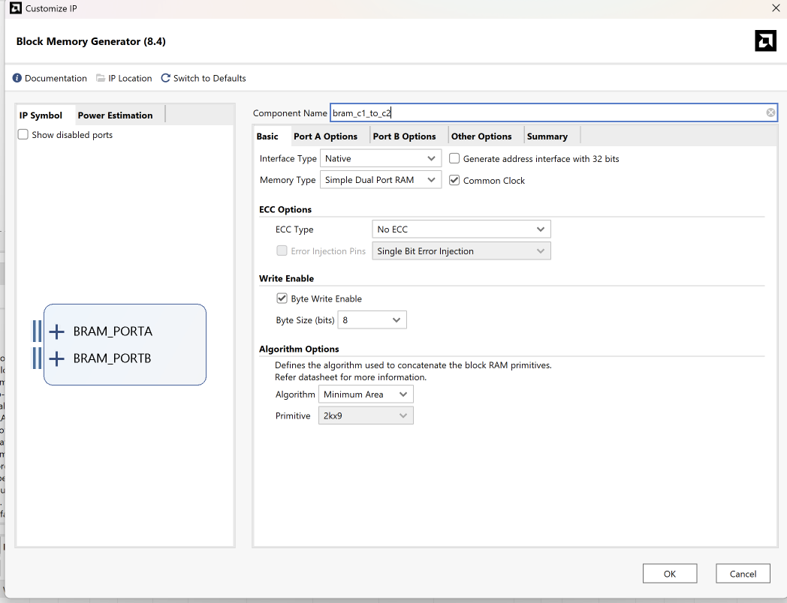 |
| Port A | 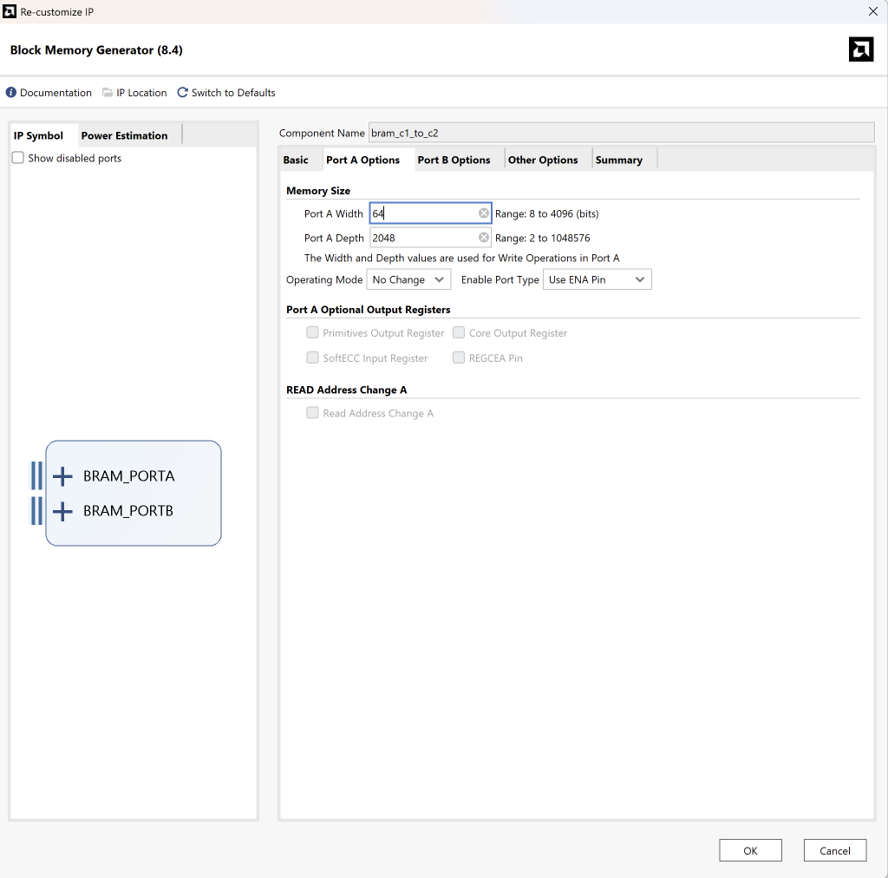 |
| Port B | 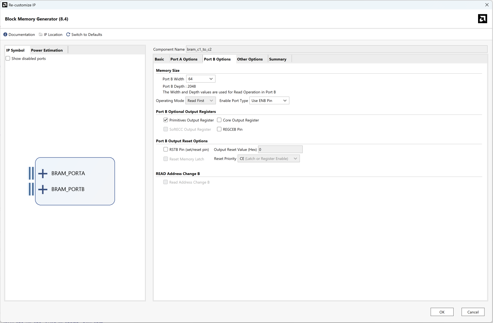 |
| Summary | 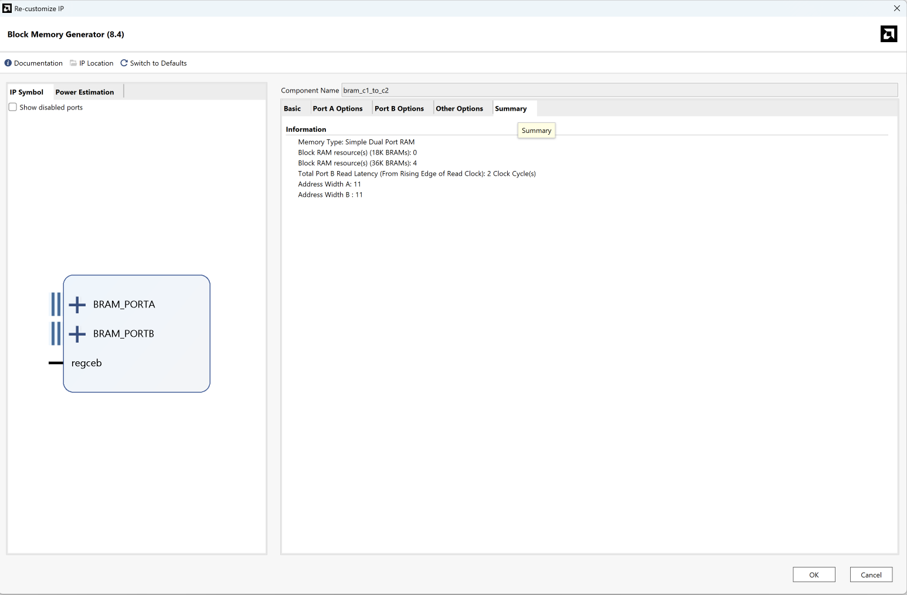 |

ping-pong buffer 의 design 초안: `bram_c1_to_c2/ping_pong_design_draft.jpeg`.

---

## 3. `bram_c2_to_pool` — Conv2 → Maxpool ping-pong buffer

### 3.1 용도

Conv2 의 16 OC × 24×24 output 을 Maxpool 의 input BRAM 으로 전달. 2 bank ping-pong.

### 3.2 Vivado 설정

| Tab | 항목 | 값 |
|---|---|---|
| Basic | Memory Type | Simple Dual Port RAM |
| Basic | Common Clock | ✓ |
| Basic | Byte Write Enable | **✗ 미체크** |
| Port A | Port A Width | **128** |
| Port A | Port A Depth | **2048** |
| Port A | Operating Mode | No Change |
| Port A | Enable Port Type | Use ENA Pin |
| Port B | Port B Width | 128 |
| Port B | Port B Depth | 2048 |
| Port B | Operating Mode | Write First |
| Port B | Enable Port Type | Use ENB Pin |
| Port B | Primitives Output Register | **✓ Enable** (L=2) |
| Port B | REGCEB Pin | **✓ 체크 (노출)** — engine 에서 `1'b1` 결선 (abrupt-stop p11 전파; §3.4·§A.2) |

### 3.3 Port signature

```verilog
bram_c2_to_pool inst (
    .clka  (clk),
    .ena   (Conv2 의 c2pool_we_a),
    .wea   (1'b1),                  // 1-bit, 항상 write all 128 bits
    .addra (11-bit addr),           // {bank, write_addr[9:0]}
    .dina  (128-bit, 16 OC packed),

    .clkb  (clk),
    .enb   (Maxpool 의 read enable),
    .addrb (11-bit addr),
    .doutb (128-bit, 16 OC packed)
);
```

### 3.4 왜 L=2 (Primitive Output Register Enable)? — 300MHz 오버클럭

**타이밍 사유 (300MHz, period 3.333ns @ xc7a100t-1)**: maxpool 의 유일한 임계 경로는
`c2pool BRAM doutb → p00/p01/p10/p11_flat 캡처 FF` (로직 0, BRAM clock-to-out + 128b
광대역 라우팅만). Artix-7 −1 의 Block RAM 정격 Fmax(388MHz)는 output register 사용 전제 —
L=1 (output reg OFF) 은 array latch clock-to-out(~2.3ns) 이 커서 300MHz 에서 negative
slack. L=2 (output reg ON) 은 clock-to-out 이 ~0.45ns 로 줄어 약 +1.8ns 슬랙 확보.

> ⚠️ **L=2 는 maxpool_fsm 의 phase counting 수정과 반드시 묶여야 한다.**
> L=2 는 doutb 가 L=1 대비 1 cycle 늦게 도착하므로, `RTL/maxpool/maxpool_fsm.v` 의 capture
> phase 를 +1 시프트했다 (6-phase 0~5 → **7-phase 0~6**). 주소 발행(phase 0~3)·rd_en
> 스케줄은 그대로, capture 만 phase 3/4/5/6 (p00/p01/p10/p11) 으로 이동.
>
> **REGCEB pin 노출 + engine `1'b1` 상수 결선 필수.** 마지막 read(p11) 가 phase 3 에서 발행된 뒤
> phase 4~6 에서 ENB=0 이 되어도, output reg 가 항상 core 를 follow(REGCEB=1) 해야 p11 이
> doutb 까지 전파된다. ENB 와 묶이면 p11 누락 → max 작아짐 (weight BMG §5.5 와 동일 이슈).
>
> ⚠️ **정정 (2026-06-02):** 과거 "c1c2 처럼 REGCEB 미노출 + 내부 tie-1" 로 적었으나 **틀렸음**.
> REGCEB 미노출 시 Vivado 는 출력 reg CE 를 1 이 아니라 **ENB 에 tie** → abrupt-stop 인 c2pool 은
> p11 누락. c1c2/bram_input 은 *연속 read* 라 미노출이 무해했을 뿐. c2pool 은 conv weight BMG 처럼
> **노출+tie1** 이어야 한다. 실 IP 검증: maxpool 단독 + end-to-end Vivado PASS (2026-06-02). (§A.2)

cycle-by-cycle 동작은 `RTL/maxpool/maxpool_fsm.v` (7-phase logic) 및 `bmg_sim_models.v`
의 `bram_c2_to_pool` (L=2 2-stage 모델) 참조. 변경 전(L=1)은 git 이력 참조.

### 3.5 참고 스크린샷

| Tab | Screenshot |
|---|---|
| Basic |  |
| Port A | 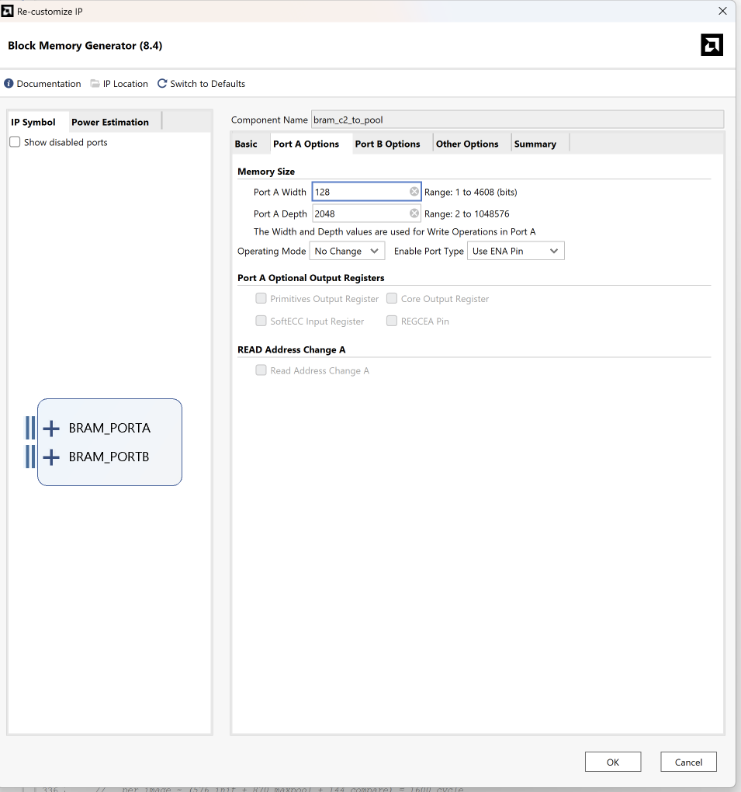 |
| Port B | 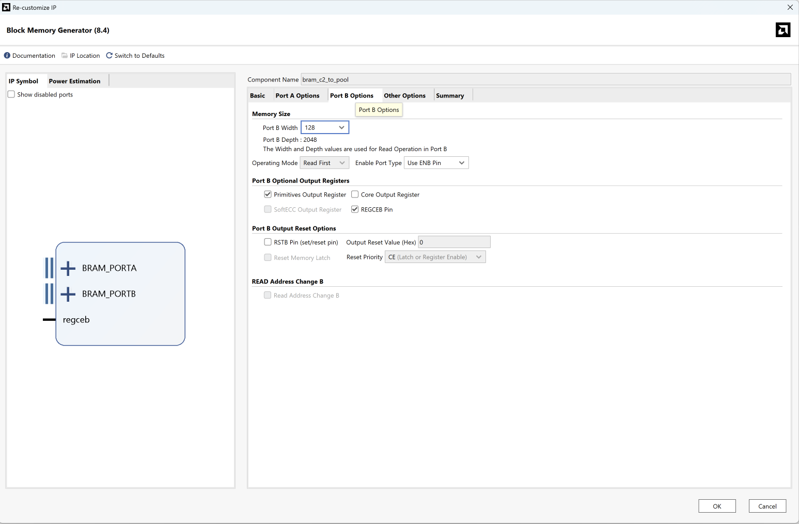 |
| Summary |  |

---

## 4. `bram_pool_to_fc` — Maxpool → FC ping-pong buffer

### 4.1 용도

Maxpool 의 16 OC × 12×12 = 144 spatial word (각 word = 16 ch × 8b packed) 를 FC layer 입력으로 전달.
2 bank ping-pong: maxpool 이 한 image 처리하는 동안 FC 가 이전 image 처리.

### 4.2 Vivado 설정

| Tab | 항목 | 값 |
|---|---|---|
| Basic | Interface Type | Native |
| Basic | Memory Type | Simple Dual Port RAM |
| Basic | Common Clock | ✓ |
| Basic | Byte Write Enable | ✗ 미체크 |
| Port A | Port A Width | **128** |
| Port A | Port A Depth | **512** (= 2 bank × 256, valid 144 + padding 112 / bank) |
| Port A | Operating Mode | No Change (write only) |
| Port A | Enable Port Type | Use ENA Pin |
| Port B | Port B Width | 128 |
| Port B | Port B Depth | 512 |
| Port B | Operating Mode | Read First |
| Port B | Enable Port Type | Use ENB Pin |
| Port B | Primitives Output Register | **✓ Enable** (L=2) ★ 300MHz |
| Port B | REGCEB Pin | **✓ 체크 (노출)** — engine `1'b1` 결선 (abrupt-stop sp143 전파; §4.4·§A.2) |

### 4.3 Port signature

```verilog
bram_pool_to_fc inst (
    .clka  (clk),
    .ena   (maxpool 의 poolfc_wr_en),    // = ENA
    .wea   (maxpool 의 poolfc_wr_en),    // 1-bit (Byte Write Disable)
    .addra (9-bit),                      // {poolfc_bank_sel, out_addr[7:0]} = bank*256 + pixel
    .dina  (128-bit, 16 OC packed),

    .clkb  (clk),
    .enb   (FC 의 poolfc_re = fsm_comp_v),
    .addrb (9-bit),                      // {input_bank_sel, s_cnt[7:0]}
    .doutb (128-bit, 16 OC packed)
);
```

### 4.4 왜 L=2 (Primitive Output Register Enable)? — 300MHz

⚠️ **정정 (2026-06-02): 과거 L=1 이었으나 300MHz refactor 로 L=2 전환.** `bram_c2_to_pool`/`bram_input`
과 동일 사유 (Artix-7 −1 BRAM 정격 Fmax 가 output reg 전제). `RTL/fc/fc_engine.v` 가 poolfc L=2 에
맞춰 정렬됨: `CTRL_DELAY` 8→9, pe/adder/acc tap 전부 +1 시프트.

**REGCEB 노출 필수 (engine `1'b1` 결선):** FC 의 마지막 read (pair4 sp143) 직후 `comp_v`(=ENB)=0 이
되어도 출력 reg 가 always-follow 여야 sp143 이 doutb 까지 전파된다. 미노출이면 실 IP 가 ENB-gated 라
sp143 누락 → pair4 logit(OC8,9) 오류 (`bram_c2_to_pool` p11 누락과 동일 원인; §A.2). 검증: real
poolfc IP 경로 `tb_cnn_accelerator_multi` 40/40 PASS (iverilog, 2026-06-02).
Maxpool 측 (write) 는 L 영향 없음 (write only port).

### 4.5 왜 Depth 512 (실제 valid 288)?

- valid 영역: 2 bank × 144 = 288 entry
- depth 512 = 다음 power-of-2 → BRAM 자원 정렬 efficient (36K BRAM 2 개)
- maxpool 측 addr [8:0] = {bank_sel[0], out_addr[7:0]}: bank 0 = 0~143 + 144~255 padding, bank 1 = 256~399 + 400~511 padding
- FC 측 addr [8:0] = {bank_sel, s_cnt[7:0]}: bank 0 = 0~143, bank 1 = 144~287 (FC 가 s_cnt+144 base 로 access)
- maxpool addr 의 padding 영역 (144~255 of bank 0, 400~511 of bank 1) 은 사용 안 함

### 4.6 참고 스크린샷

| Tab | Screenshot |
|---|---|
| Basic | 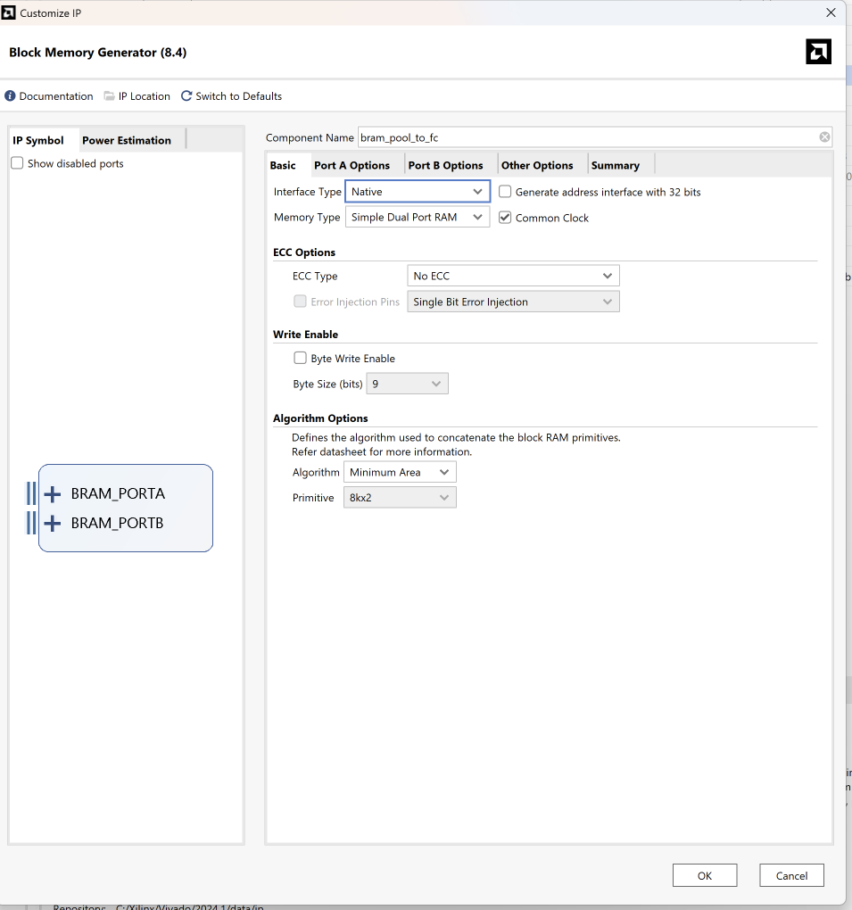 |
| Port A | 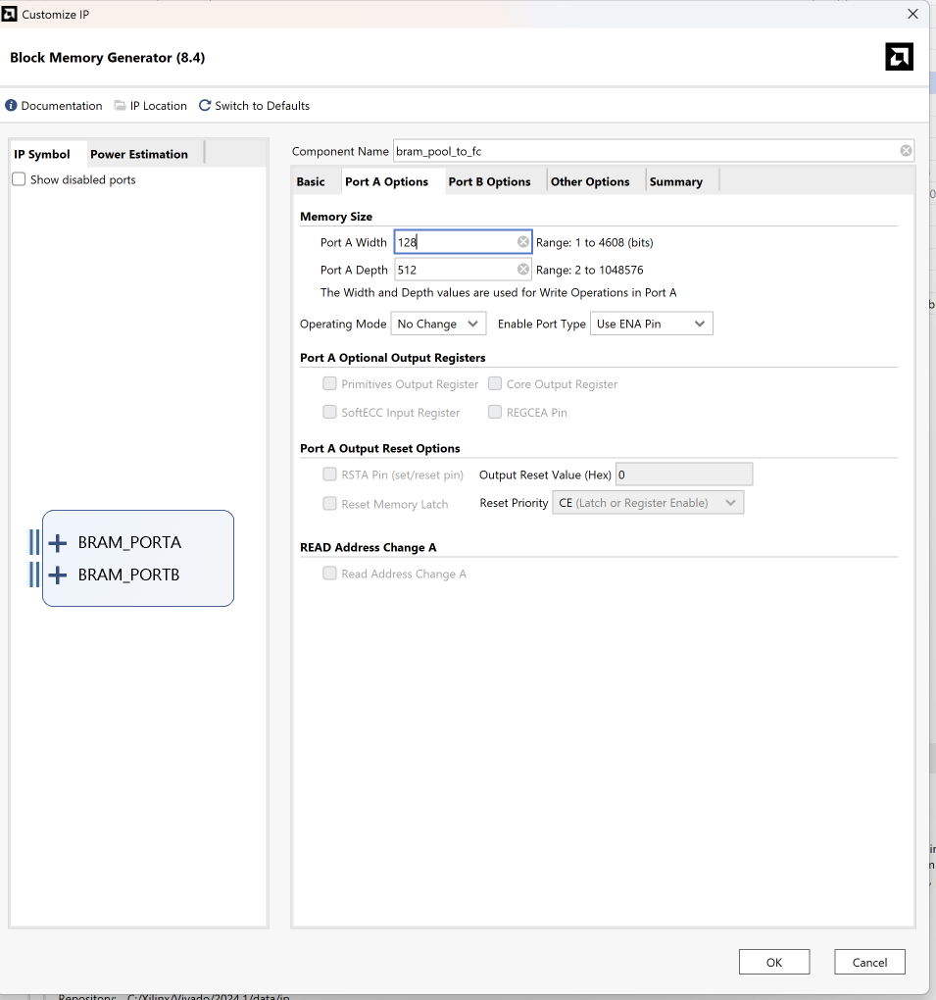 |
| Port B | 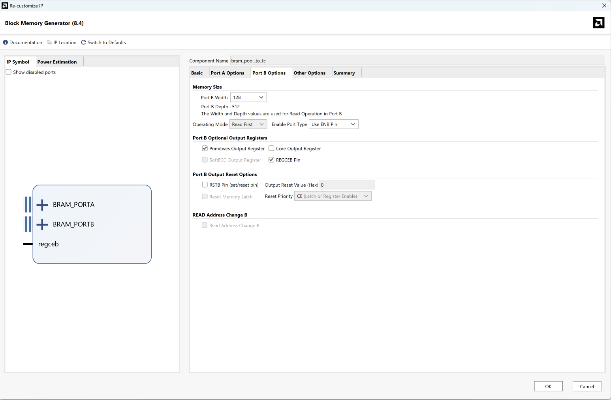 |
| Summary | 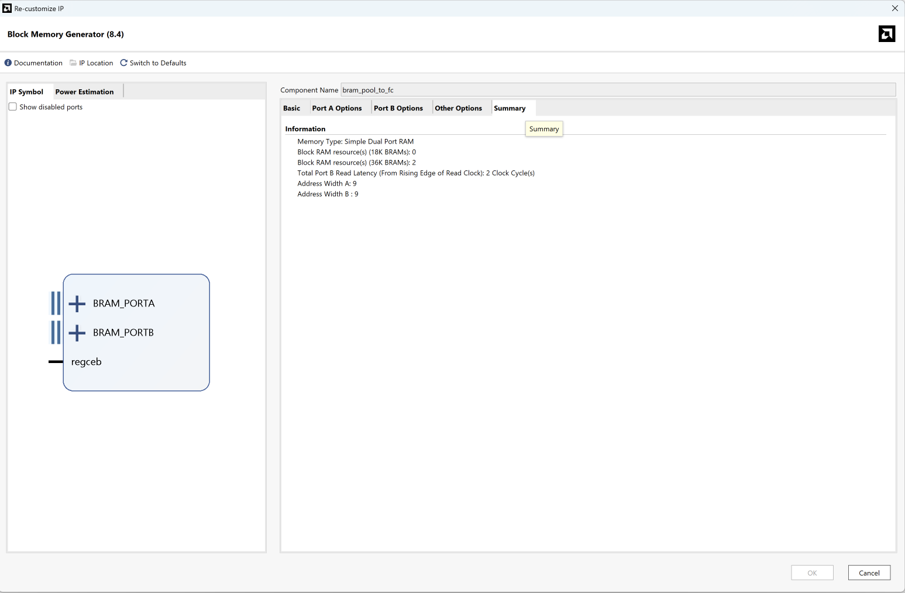 |

---

## 5. `conv2_weight_bram` — PS → Conv2 weight

### 5.1 용도

Pre-packed Conv2 SIMD weight (576 entry × 32-bit) 를 PS 측에서 AXI BRAM Controller 로 write,
Conv2 의 weight_loader 가 read 하여 192 PE 에 분배 (시스템 시작 시 1회).

### 5.2 Vivado 설정

| Tab | 항목 | 값 |
|---|---|---|
| Basic | Memory Type | Simple Dual Port RAM |
| Basic | Common Clock | **✓ 체크** |
| Basic | Byte Write Enable | **✗ 미체크** |
| Port A | Port A Width | **32** |
| Port A | Port A Depth | **1024** (576 만 사용, 1024 = power of 2 라 36K BRAM 1 개 efficient) |
| Port A | Operating Mode | No Change |
| Port A | Enable Port Type | Use ENA Pin |
| Port B | Port B Width | **32** (= Port A Width, A/B 비대칭 X) |
| Port B | Port B Depth | 1024 (자동) |
| Port B | Operating Mode | Write First |
| Port B | Enable Port Type | Use ENB Pin |
| Port B | Primitives Output Register | **✓ 체크** (L=2) |
| Port B | REGCEB Pin | **✓ 체크** (외부 결선 필요) |

### 5.3 Port signature

```verilog
conv2_weight_bram inst (
    .clka   (clk),
    .ena    (c2w_ena),             // ★ ENA — write 시 1 (ENA + WEA 둘 다 필요!)
    .wea    (c2w_ena),             // 1-bit wea (Byte Write Disable)
    .addra  (10-bit),
    .dina   (32-bit),              // SIMD packed weight (A_port = W1*2^17 + W0)

    .clkb   (clk),
    .enb    (1-bit, weight_loader 가 read 중일 때만 1),
    .addrb  (10-bit),
    .doutb  (32-bit),
    .regceb (1-bit)                // ★ 외부 결선 — `1'b1` 상수 묶음
);
```

> ⚠️ **"Use ENA Pin" 옵션 → ENA, WEA 두 신호 모두 결선 필수**.
> 둘 중 하나만 결선 시 write 안 일어남. (BMG 의 Port A write 는 `ENA AND WEA = 1` 조건.)
> 기존 behavioral 모델은 ENA 만 있었으나 (단순화), 실제 IP 와 wiring 차이 주의.

### 5.4 참고 스크린샷

| Tab | Screenshot |
|---|---|
| Basic | 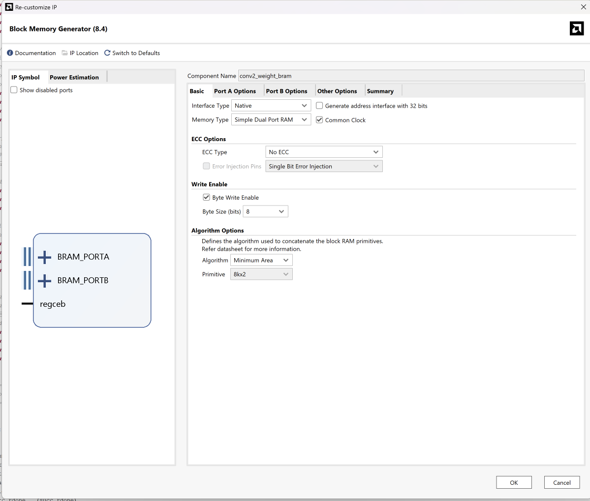 |
| Port A | 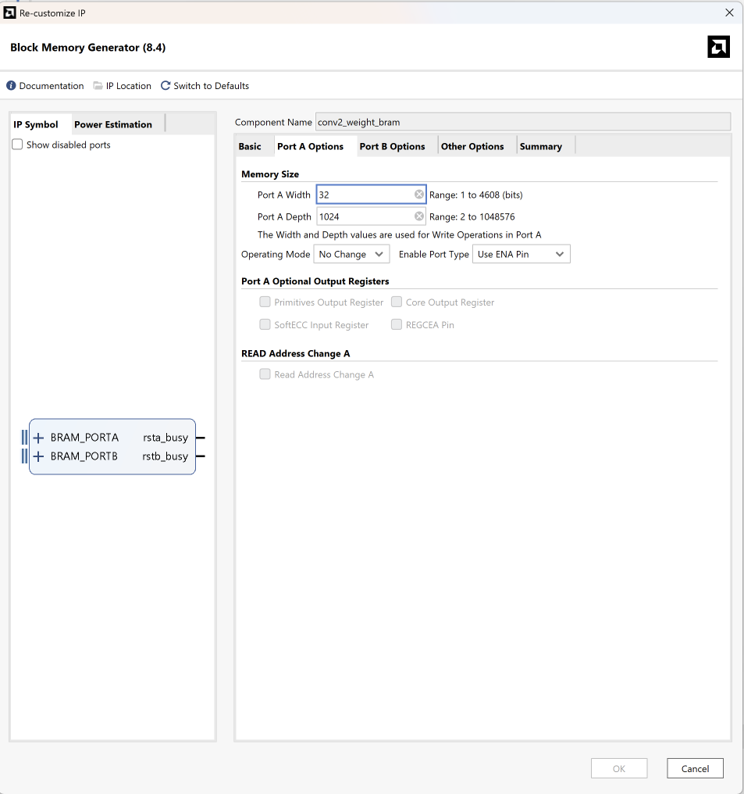 |
| Port B | 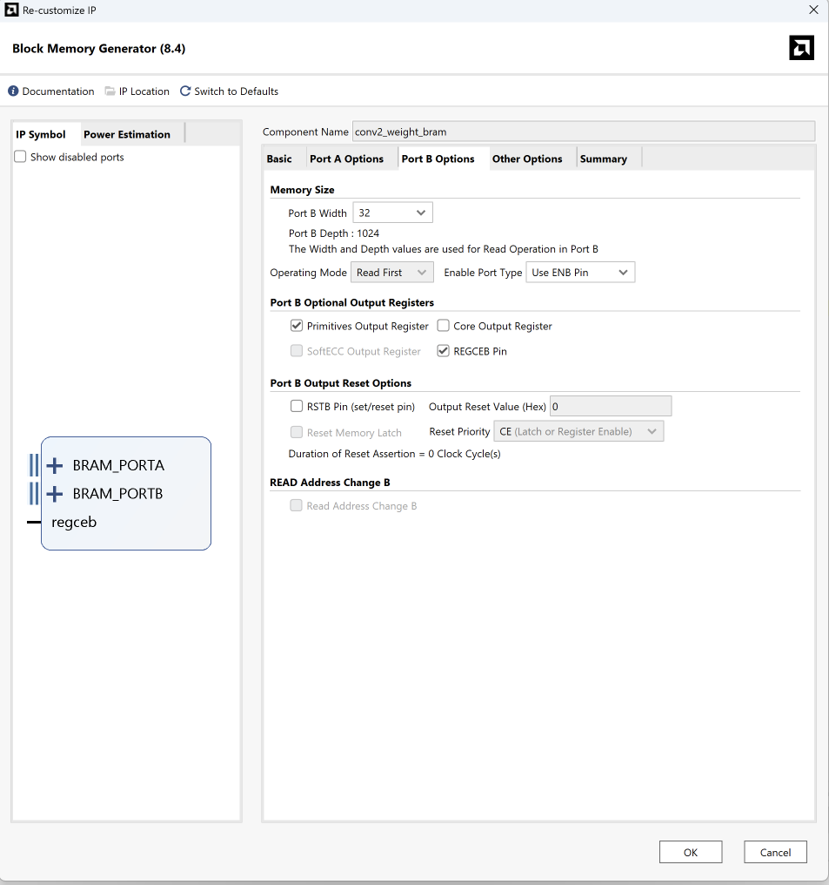 |
| Summary | 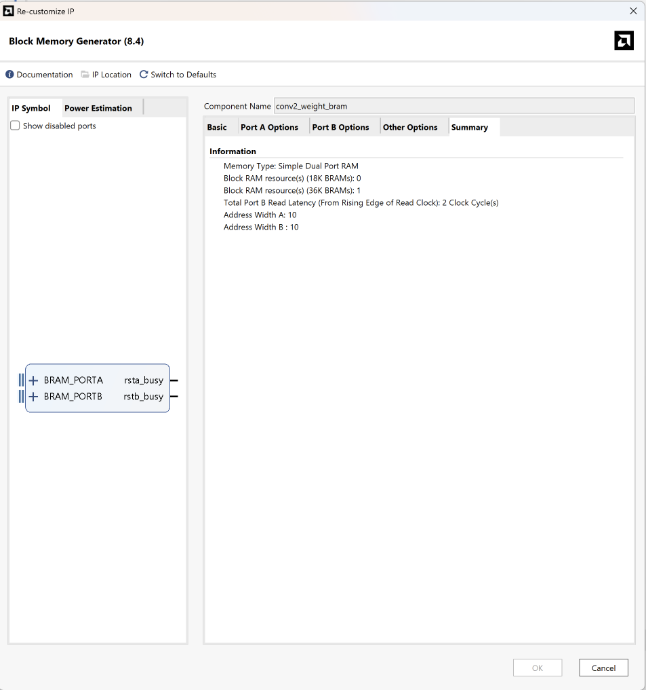 |

### 5.5 왜 REGCEB Pin 노출 + 상수 1 결선?

`weight_loader_conv2.v` 가 575 cycle 동안 sequential read 후 ENA=0 으로 OFF.
**L=2 의 output register 가 마지막 weight (mem[575]) 를 dout 으로 내보내려면 ENA=0 이후에도
REGCEB=1 이 1 cycle 더 필요**. ENB 와 같이 묶이면 → 마지막 weight 누락 → PE 적재 실패.

→ REGCEB pin 노출하고 engine 에서 `.regceb(1'b1)` 상수 결선:

```verilog
// conv2_engine.v
conv2_weight_bram c2w_bmg_inst (
    .enb    (c2w_enb),
    .regceb (1'b1)        // ← 마지막 weight propagation 보장
);
```

상세 메커니즘은 §부록 A 참조.

---

## 6. `bram_input` — PS → Conv1 input image (ping-pong, asymmetric width)

### 6.1 용도

PS 가 MNIST input image (28×28, 1 channel, INT8) 를 AXI BRAM Controller 로 **32-bit burst write**,
Conv1 의 input streaming 이 **8-bit byte read**. Port A/B width 가 다른 **asymmetric BMG**.

**2 bank ping-pong**: PS 가 다음 image 를 미리 write 하는 동안 Conv1 은 현재 image 처리.

총 메모리 = 2 KB = 2 bank × 1024 byte. PS 측에서는 512 word × 32-bit, Conv1 측에서는 2048 byte × 8-bit.

### 6.2 Vivado 설정

| Tab | 항목 | 값 |
|---|---|---|
| Basic | Memory Type | Simple Dual Port RAM |
| Basic | Common Clock | ✓ |
| Basic | Byte Write Enable | ✗ 미체크 |
| Port A | Port A Width | **32** (AXI burst — 4 byte per cycle) |
| Port A | Port A Depth | **512** (= 2048 byte / 4 byte = 512 word) |
| Port A | Operating Mode | No Change |
| Port A | Enable Port Type | Use ENA Pin |
| Port B | Port B Width | **8** (Conv1 픽셀 단위 read) |
| Port B | Port B Depth | 2048 (자동 — Vivado 가 A=32×512 와 같은 메모리 크기로 맞춤) |
| Port B | Operating Mode | Read First (강제도 OK) |
| Port B | Enable Port Type | Use ENB Pin |
| Port B | **Primitives Output Register** | **✓ Enable (L=2)** ★ 300MHz |
| Port B | Core Output Register | ✗ |
| Port B | REGCEB Pin | 미노출 (Vivado 내부 tie-1) |

> **왜 L=2? — 300MHz 오버클럭** (target `xc7a100t-csg324-1`, speed grade −1).
> Artix-7 −1 BRAM 정격 Fmax 388MHz 는 **output register 전제**. L=1 (core reg only) 은
> BRAM clock-to-out ~2.3ns + window 캡처 경로가 300MHz(3.33ns) 에서 negative slack →
> L=2 로 clock-to-out ~0.45ns (~+1.8ns 슬랙). `bram_c2_to_pool`/maxpool 와 동일 근거.
> conv1 은 L=2 의 +1 cycle latency 를 `conv1_fsm` 의 OUT_DELAY(=L+N+4=10) 로 흡수
> (cycle-by-cycle 증명: `docs/conv1_timing.md`). REGCEB 미노출 — read 가 RUN/FLUSH 동안
> 연속(enb=pipe_en)이라 마지막 데이터가 FLUSH 중 propagate (conv2 c1c2 와 동일 케이스).
>
> ⚠️ 과거 L=1 이었음 (구 conv1 6-cycle pipeline 가정). 300MHz refactor 로 L=2 전환.

### 6.3 Port signature

```verilog
bram_input inst (
    .clka  (clk),
    .ena   (1-bit),
    .wea   (1-bit),
    .addra (9-bit),                 // word addr (0..511). MSB = bank.
    .dina  (32-bit),                // {byte3, byte2, byte1, byte0} (little-endian)

    .clkb  (clk),
    .enb   (in_bram_en = pipe_en),
    .addrb (11-bit = {input_bank_sel, in_addr[9:0]}),   // byte addr (0..2047)
    .doutb (in_bram_dout = signed [7:0])                // 1 byte per cycle
);
```

### 6.4 Byte 순서 (asymmetric BMG)

Vivado BMG 의 asymmetric width 는 **little-endian byte order** (default):
- Port A 의 word k 가 byte 4k, 4k+1, 4k+2, 4k+3 을 한꺼번에 담음.
- Port A dina = `{byte3, byte2, byte1, byte0}` 형태로 PS / TB 가 packing.
- Port B addr 4k+0 read → byte0 (= dina[7:0]).
- Port B addr 4k+1 read → byte1 (= dina[15:8]).
- 이런 식.

### 6.5 PS / TB Port A write pattern (single image, bank 0)

```verilog
// 784 byte image → 196 word
for (k = 0; k < 196; k = k + 1) begin
    in_addra = {1'b0, k[7:0]};        // bank 0 = MSB 0, word addr 0..195
    in_dina  = {input_mem[k*4 + 3],
                input_mem[k*4 + 2],
                input_mem[k*4 + 1],
                input_mem[k*4 + 0]};   // little-endian pack
end
```

> 784 = 4 × 196 정확히 나누어떨어짐 (운 좋게도). Padding 불필요.

### 6.6 참고 스크린샷

| Tab | Screenshot |
|---|---|
| Basic |  |
| Port A | 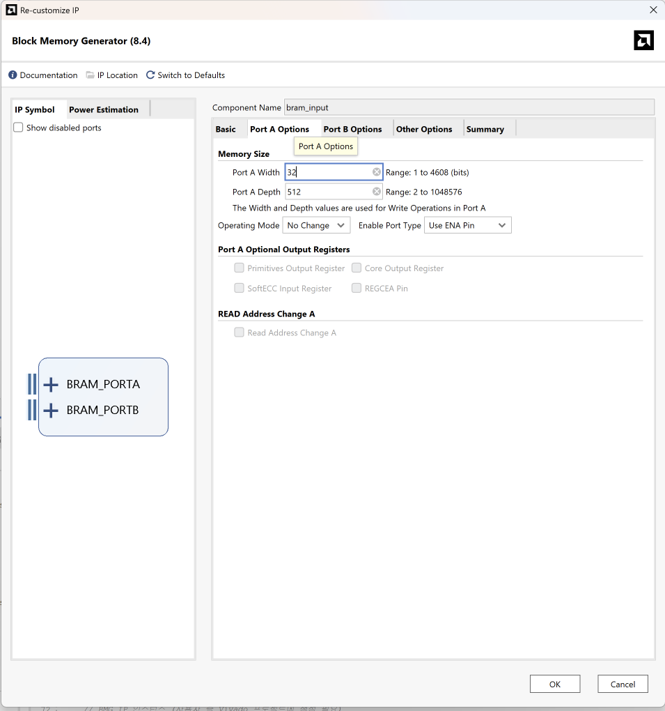 |
| Port B |  |
| Summary | 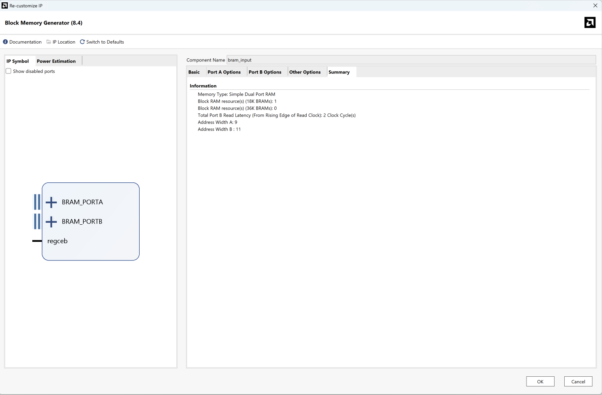 |

---

## 7. `conv1_weight_bram` — PS → Conv1 weight

### 7.1 용도

Pre-packed Conv1 SIMD weight (36 entry × 32-bit) 를 PS 가 write,
weight_loader 가 read 하여 18 PE 적재 (시스템 시작 시 1회).
인스턴스 위치: `conv1_engine.v` 내부 (`c1w_bmg_inst`) — conv2/fc weight 와 일관 (Port A 만 외부 passthrough).

### 7.2 Vivado 설정

| Tab | 항목 | 값 |
|---|---|---|
| Basic | Memory Type | Simple Dual Port RAM |
| Basic | Common Clock | ✓ |
| Basic | Byte Write Enable | ✗ 미체크 |
| Port A | Port A Width | **32** |
| Port A | Port A Depth | **64** (≥36; 64 = power of 2) |
| Port A | Operating Mode | No Change |
| Port A | Enable Port Type | Use ENA Pin |
| Port B | Port B Width | 32 |
| Port B | Port B Depth | 64 |
| Port B | Operating Mode | Write First |
| Port B | Enable Port Type | Use ENB Pin |
| Port B | Primitives Output Register | ✓ 체크 (L=2) |
| Port B | REGCEB Pin | **✓ 체크** (외부에서 1 결선 필요 — conv2_weight 와 동일 사유) |

### 7.3 Port signature

```verilog
// conv1_engine.v 내부 인스턴스 (c1w_bmg_inst)
conv1_weight_bram c1w_bmg_inst (
    .clka  (clk),
    .ena   (c1w_ena),               // ENA + WEA 둘 다 결선 필수 (Conv2 weight 와 동일)
    .wea   (c1w_ena),
    .addra (c1w_addra),             // 6-bit, PS write Port A
    .dina  (c1w_dina),              // 32-bit SIMD packed weight (W1*2^17 + W0)

    .clkb  (clk),
    .enb   (w_bram_en),             // weight_loader ↔ 내부 wire
    .addrb (w_bram_addr),           // 6-bit
    .doutb (w_bram_dout),           // 32-bit
    .regceb(1'b1)                   // 마지막 weight propagation 보장
);
```

> ⚠️ Conv2 weight 와 동일 — ENA + WEA 둘 다 결선 + REGCEB 노출 + 상수 1.

### 7.4 참고 스크린샷

| Tab | Screenshot |
|---|---|
| Basic |  |
| Port A | 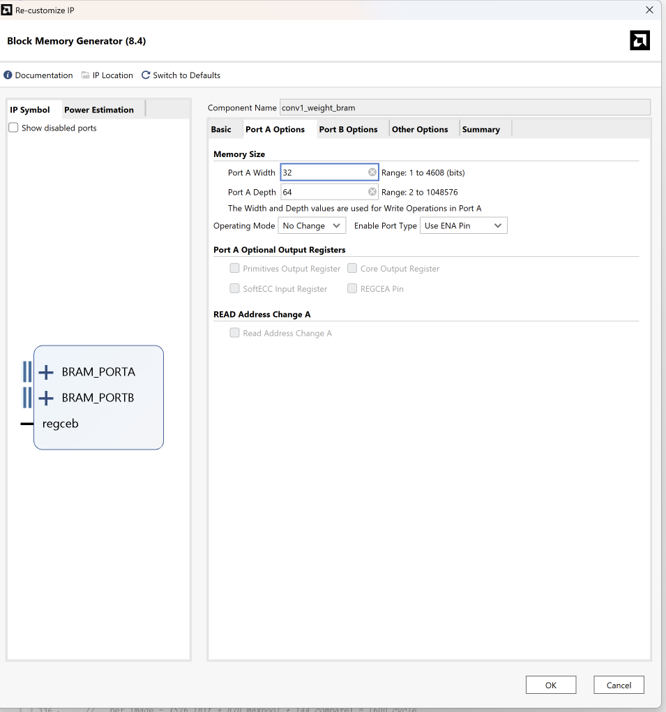 |
| Port B | 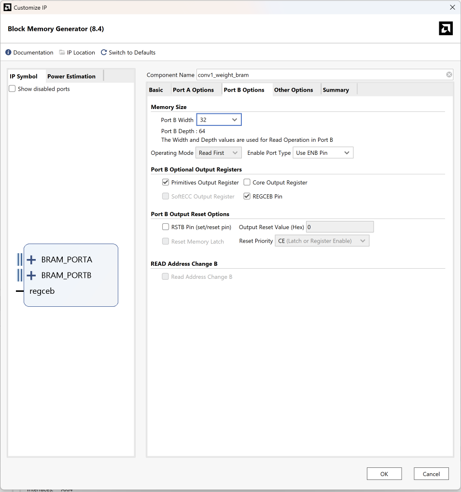 |
| Summary | 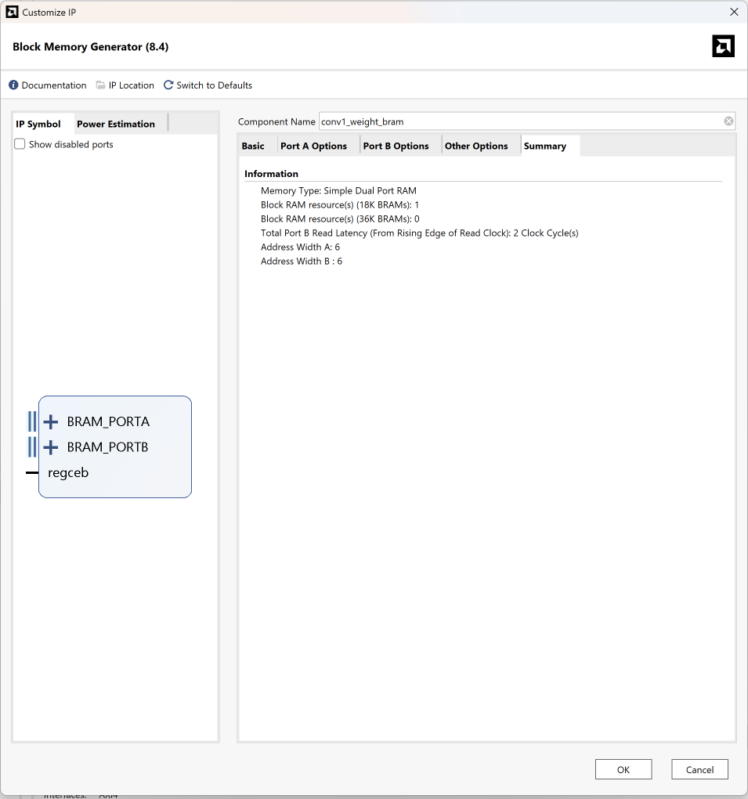 |

---

## 8. `fc_weight_bram` — PS → FC weight

### 8.1 용도

Pre-packed FC SIMD weight (720 entry × 512-bit = 16 input channel × 32b SIMD-A; A=W1·2¹⁷+W0) 를
PS 가 **변환 없이 그대로** write (gen 산출 `fc_weights_simd` 11520×32b → 16 A/word).
`fc_fsm` 의 `fcw_addrb = wbase + s_cnt` (pair-major) 으로 read → `fc_pe_array` 가 lane 별
`[ch*32 +: 25]` 를 `pe_cell.packed_w` 로 직결 (conv1/conv2 와 동일 SIMD-direct).

### 8.2 Vivado 설정

| Tab | 항목 | 값 |
|---|---|---|
| Basic | Memory Type | Simple Dual Port RAM |
| Basic | Common Clock | ✓ |
| Basic | Byte Write Enable | **✓ (byte size 8 → wea 64-bit)** |
| Port A | Port A Width | **512** |
| Port A | Port A Depth | **1024** (720 used, 1024 power-of-2) |
| Port A | Operating Mode | No Change |
| Port A | Enable Port Type | Use ENA Pin |
| Port B | Port B Width | 512 |
| Port B | Port B Depth | 1024 |
| Port B | Operating Mode | Read First |
| Port B | Enable Port Type | Use ENB Pin |
| Port B | Primitives Output Register | **✓ Enable** (L=2) ★ 300MHz |
| Port B | REGCEB Pin | **✓ 체크 (노출)** — engine `1'b1` 결선 (abrupt-stop pair4 sp143 전파; §A.2) |

### 8.3 Port signature

```verilog
fc_weight_bram inst (
    .clka   (clk),
    .ena    (fcw_ena),                 // ENA + WEA 둘 다 결선 (Port A write)
    .wea    (fcw_wea),                 // 64-bit byte-write (AXI WSTRB 직결)
    .addra  (10-bit),
    .dina   (512-bit),                 // 16ch × 32b SIMD-A (gen 그대로)

    .clkb   (clk),
    .enb    (fc_fsm 의 fsm_comp_v),
    .addrb  (10-bit),                  // wbase + s_cnt (pair-major)
    .doutb  (512-bit),                 // 16ch × 32b SIMD-A → fc_pe_array 가 [ch*32+:25] 직결
    .regceb (1'b1)                     // 출력 reg always-follow (L=2, abrupt-stop sp143 전파)
);
```

> ⚠️ `RTL/fc/fc_engine.v:105` 에서 위 패턴 적용됨 (FC fix #2). conv2 의 동일 패턴 참조.

---

## 9. (TBD) 공통 도구

### 9.1 Hex → COE 변환

Vivado IP customization 의 "Other Options" tab 에서 "Load Init File" 로 BMG 초기 메모리 init 가능. `.coe` format 필요. 변환 script (예: `scripts/weights/hex_to_coe.py`) — 현재 TBD.

대안: testbench 에서 Port A driving 으로 weight init (현재 `tb_conv2_engine.v` 의 `init_weight()` 방식).

---

## 부록 A: REGCEB pin 결선 원칙

### A.1 REGCEB 가 뭔지

BMG Port B 의 Primitive Output Register (L=2 stage) 의 **clock enable**:

```
mem[addrb]  ─→  core register  ─→  output register  ─→  doutb
                  ↑                    ↑
                gated by ENB        gated by REGCEB
```

- REGCEB=1: edge 마다 `output_reg ← core` (core 를 follow)
- REGCEB=0: output_reg HOLD (= doutb 값 고정)

### A.2 REGCEB pin 노출 vs 미노출

> ⚠️ **정정 (2026-06-02):** REGCEB pin 미노출 시 Vivado 는 출력 reg CE 를 **상수 1 이 아니라 ENB 에 tie**
> 한다 (= ENB-gated). 따라서 **연속 read** 면 무해(마지막 데이터가 다음 ENB=1 read 때 전파)하지만,
> **마지막 read 직후 ENB=0 으로 끊기는(abrupt-stop)** 경우엔 마지막 데이터가 출력 reg 를 못 빠져나가
> **누락**된다. 과거 본 표는 "미노출 = 내부 1 tie" 로 잘못 적었고, sim model 도 always-follow 로 모델링해
> 이 괴리가 iverilog 에서 안 보였다 — c2pool p11 / poolfc sp143 누락 버그의 근본원인.
>
> **정책 (정정 2026-06-02): 노출 여부는 소비자 read 패턴에 따라 정반대 — 일괄 노출 금지.**
> ① **abrupt-stop** (마지막 read 후 ENB=0, 그 데이터를 흘려보내야 함) → **노출 + `1'b1` tie (always-follow) 필수.**
> ② **streaming + 소비자가 ENB=0 구간 출력 hold 에 의존** (conv1/conv2 의 input BRAM read) → **미노출 (ENB-gated) 필수.**
> 노출+tie1 로 바꾸면 hold 가 깨져 conv 가 틀린 데이터를 읽는다 (`bram_input`/`bram_c1_to_c2` 가 ②).
> ⚠️ 과거 "전부 노출"로 적었으나 **틀림** — full pipeline 깨짐(2026-06-02 regression). (output reg ON = read latency +1 → FSM 재정렬 필요.)

| 시나리오 | REGCEB pin | 결선 |
|---|---|---|
| **streaming + 소비자가 ENB=0 구간 출력 hold 에 의존** (conv1/conv2 의 input BRAM read) | **미노출 필수 (ENB-gated)** | `.regceb` 결선 안 함. 노출+tie1=always-follow 면 hold 깨져 conv 오답 (full 0/40). (예: `bram_input`, `bram_c1_to_c2`) |
| **마지막 read 직후 즉시 ENB=0 (abrupt-stop)** | **노출 필수** | engine 에서 `1'b1` 상수 결선 → always-follow. 미노출이면 ENB-gated 라 마지막 데이터 누락. (예: `conv2_weight_bram`/`conv1_weight_bram` weight 마지막; **`bram_c2_to_pool`** maxpool p11; **`bram_pool_to_fc`** FC sp143; **`fc_weight_bram`** FC weight pair4 sp143) |

### A.3 결선 예제

```verilog
// 미노출 케이스 (bram_c1_to_c2)
bram_c1_to_c2 c1c2_bram (
    .enb   (shift_en),              // ENA 만 결선
    .addrb (addr),
    .doutb (dout)
    // .regceb (...) ← port 자체가 없음
);

// 노출 케이스 (conv2_weight_bram)
conv2_weight_bram c2w_bmg (
    .enb    (c2w_enb),
    .addrb  (c2w_addrb),
    .doutb  (c2w_doutb),
    .regceb (1'b1)                  // ← 상수 1 결선
);
```

---

## 부록 B: L=1 vs L=2 선택 가이드

### B.1 L (read latency) 의 정의

- **L=1**: addr@T → doutb@T+1 (core register 만)
- **L=2**: addr@T → doutb@T+2 (core + output register)

### B.2 선택 기준

- **사용 모듈의 FSM 이 어떤 L 가정으로 작성되었는가** 가 유일한 결정 요인.
- L=1 ↔ L=2 변경 시 FSM 의 cycle 가정 (1 cycle shift) 깨짐 → mismatch.

### B.3 현재 프로젝트의 선택

| BMG | L | 이유 |
|---|---|---|
| `bram_c1_to_c2` | 2 | Conv2 fanout uniformity (모든 IC × line_buffer 까지 timing balance). `conv2_timing.md` 참조. |
| `bram_c2_to_pool` | 2 | 300MHz: maxpool_fsm 7-phase (L=2). 출력 reg **REGCEB 노출+tie1** (abrupt-stop p11 전파). |
| `bram_pool_to_fc` | 2 | 300MHz: fc_engine `CTRL_DELAY=9` (L=2). 출력 reg **REGCEB 노출+tie1** (abrupt-stop sp143 전파). |
| `conv2_weight_bram` | 2 | weight_loader 의 `latch_valid_dd` (2-cycle 지연) 가 L=2 가정. |
| `conv1_weight_bram` | 2 | conv1_weight_loader 의 `latch_valid_dd` (2-cycle 지연) 가 L=2 가정. |
| `bram_input` | 2 ★ | 300MHz: Artix-7 −1 BRAM 정격 Fmax(388MHz)가 output reg 전제. conv1_fsm OUT_DELAY=L+N+4=10 으로 +1 흡수 (docs/conv1_timing.md). |
| `fc_weight_bram` | 2 | 300MHz: fc_engine `CTRL_DELAY=9` (L=2, poolfc 와 정렬). 출력 reg **REGCEB 노출+tie1** (abrupt-stop pair4 sp143 전파; 구 fabric reg fcw_doutb_r 제거, conv weight BMG 와 통일). |

### B.4 L=2 채택 시 추가 고려

- REGCEB pin 노출 여부 (§부록 A 참조)
- output reg 가 추가 1 cycle latency 도입 → FSM 전이 조건 1 cycle 늦춰서 매핑 필요

---

## 부록 C: 본 문서 유지 관리

- IP 설정 변경 시 반드시 본 문서 update
- 새 BMG IP 추가 시 §1 표 + 새 섹션 추가
- Vivado IP customization screenshot 은 `docs/ip_spec/<ip_name>/` 에 저장. 디렉토리 이름은 **IP 코드 이름과 일치** (예: `bram_c1_to_c2/`, `bram_c2_to_pool/` (캡처 시), `bram_pool_to_fc/`, `bram_input/`, `conv1_weight_bram/`, `conv2_weight_bram/`, `fc_weight_bram/` (캡처 시)). 파일명 규칙: `<ip_name>-<tab>.png`, tab ∈ {basic, portA, portB, summary}.
- 관련 RTL 파일 (`*_engine.v`, `*_loader.v`) 의 결선과 본 문서가 1:1 match 되는지 주기적 검증

### 관련 문서
- `docs/cowork_guide.md` — 프로젝트 전체 onboarding
- `RTL/conv2/conv2_design.md` — Conv2 설계 + BMG L=2 결정 배경
- `RTL/conv2/conv2_timing.md` — cycle-by-cycle BRAM read pipeline
- `RTL/conv1/conv1_design.md` — Conv1 설계
