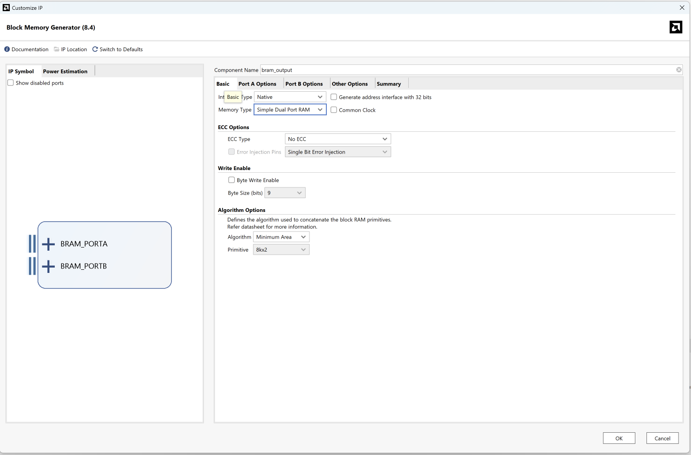
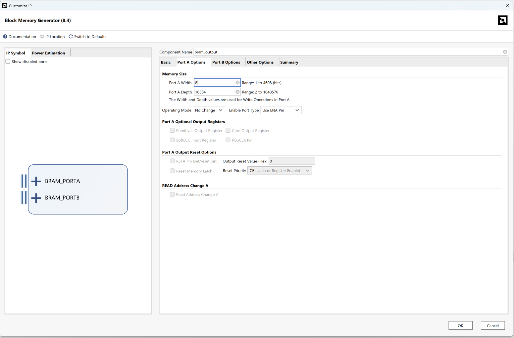
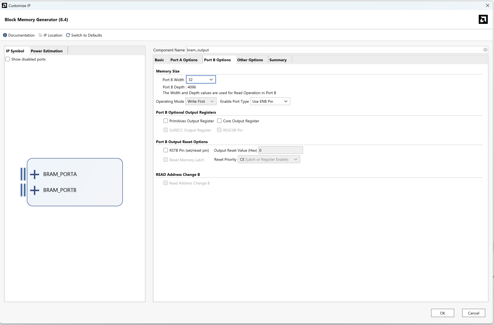
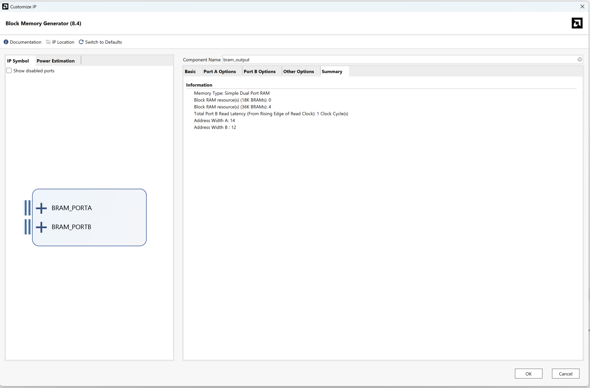

# `output_result_bram` — PL → PS 결과 저장 BRAM (+ DMA 아키텍처 설계)

**상태**: **IP 생성됨** — 컴포넌트 이름 **`bram_output`** (`bram_input` 의 거울, 2026-06-02). 스크린샷 §8.
**작업 순서**: **(1) `bram_output` 통합 — 파이프라이닝 중 결과 손실 없이 전수 검증 ← 현재** → (2) AXI CDMA burst → (3) 300MHz overclock.
**목적**: per-image PS handshake/read 병목 제거. PL 이 분류 결과를 BRAM 에 누적하고, PS 는
**끝에 한 번만 burst read** 한다. 입력 전송은 **AXI CDMA burst** 로 대체.

관련: [[vitis-mainc-bringup]] 의 serial polling 구조, `csr_axi_slave_lite_v1_0_csr.v` 의
`result_latch`(단일 4-bit) 를 대체/보완.

---

## 1. 배경 — 왜 필요한가

현재 (100MHz) 측정: **~1.4M cyc / image** (가속기 compute 는 ~1728 cyc, 나머지는 전부 PS 오버헤드).
이미지 1장마다 PS 가:

1. `can_load` polling (CSR read loop)
2. input 196 word **개별** `Xil_Out32` (uncached AXI write)
3. `img_ready` pulse
4. `img_cnt` polling (CSR read loop)
5. `result` read (STATUS[4:1])

→ 10,000 장이면 latency 목표(~96ms)와 수백 배 차이. 두 축을 분리해 해결:

| 병목 | 해결책 |
|---|---|
| **출력**: 이미지마다 result read + img_cnt polling | **결과 BRAM** — PL 이 누적, PS 가 끝에 일괄 read (본 문서 §2~3) |
| **입력**: 196 word 개별 write | **AXI CDMA** — DDR `test_images[img]` → input BRAM **한 descriptor burst** (§4) |

> ✅ 시너지: 직전 변경으로 `test_images` 가 이미 **연속 uint32[N*196]** (input BRAM Port A 포맷)
> 이라 CDMA src 로 그대로 burst 가능 (784 byte/img contiguous).

---

## 2. `bram_output` BMG 스펙  (생성 완료)

### 2.1 용도
PL 이 `img_done` 마다 현재 이미지의 분류 결과(4-bit digit)를 BRAM 에 1 byte 로 누적.
PS 는 처리 종료 후 AXI BRAM Controller 로 전체를 32-bit burst read (워드당 4 결과).

**비대칭 BMG** — `bram_input` (32 write / 8 read) 의 **거울 방향** (8 write / 32 read). IP 컴포넌트 이름 `bram_output`.

### 2.2 Vivado 설정

| Tab | 항목 | 값 |
|---|---|---|
| Basic | Interface Type | Native |
| Basic | Memory Type | **Simple Dual Port RAM** (write A / read B) |
| Basic | Common Clock | **✗ (independent)** ★ — 생성 IP 가 independent. `clka`/`clkb` 둘 다 `clk` 에 묶으면 **현재 common 처럼 동작**, overclock 시 `clkb` 만 AXI 로 분리하면 됨 (**재생성 불필요** — Common Clock 체크보다 future-proof) |
| Basic | Byte Write Enable | ✗ (write 가 1 byte 단위라 불필요) |
| Port A (PL write) | Port A Width | **8** |
| Port A | Port A Depth | **16384** (10000 used, 2¹⁴ power-of-2) |
| Port A | Operating Mode | No Change (write only) |
| Port A | Enable Port Type | Use ENA Pin |
| Port B (PS/AXI read) | Port B Width | **32** |
| Port B | Port B Depth | 4096 (자동 — 같은 메모리) |
| Port B | Operating Mode | Write First (read-only port 이라 무관) |
| Port B | Enable Port Type | Use ENB Pin |
| Port B | Primitives Output Register | **✗ (L=1)** — AXI BRAM Ctrl "Read Latency" 와 일치시킬 것 |
| Port B | REGCEB Pin | 미노출 (standard random read, **abrupt-stop 아님** → [[bmg-l2-regceb-abrupt-stop]] 무관) |

- ECC No, Algorithm Minimum Area (공통).
- 자원: 16384×8 = 128 Kb ≈ 4× BRAM36. (depth 를 10240 으로 줄이면 3개. 그래도 미미.)

### 2.3 Port signature

```verilog
bram_output res_bmg (
    // Port A — PL write (result-writer), 8-bit
    .clka  (clk),                  // datapath clk (overclock 시 PL clk)
    .ena   (res_we),               // = img_done
    .wea   (res_we),               // 1-bit (Byte Write Disable) — ENA+WEA 둘 다 결선
    .addra (res_wr_ptr),           // 14-bit, image index 0..9999 (= img_cnt)
    .dina  ({4'b0000, result}),    // 8-bit = {pad, digit[3:0]}

    // Port B — PS read via AXI BRAM Ctrl, 32-bit
    .clkb  (clk),                  // AXI clk
    .enb   (res_rd_en),            // AXI BRAM Ctrl 구동
    .addrb (res_rd_addr),          // 12-bit word addr (= AXI byte addr >> 2)
    .doutb (res_rd_data)           // 32-bit = 4 results (little-endian: img4k=[7:0])
);
```

> ⚠️ weight/conv BMG 와 동일 — Port A write 는 **ENA AND WEA** 둘 다 1 이어야 함
> (`block_memory_generator.md` §5.5). result-writer 가 둘 다 `img_done` 으로 구동.

### 2.4 Addressing / packing

- **write (8-bit)**: `addra = res_wr_ptr` = 처리 완료 이미지 index (0..9999). `dina = {4'b0, result}`.
- **read (32-bit)**: word k = image `4k..4k+3` 의 결과. **little-endian** (BMG asymmetric 기본):
  - `doutb[7:0]` = img 4k, `[15:8]` = 4k+1, `[23:16]` = 4k+2, `[31:24]` = 4k+3.
- AXI BRAM Ctrl byte addr → BMG word addr = `byte_addr >> 2`. Range 16KB → byte addr 14-bit,
  word addr `[13:2]` (12-bit). PS 는 word 0..2499 (10000 결과) read.

---

## 3. 결과 writer 로직 (PL, 신규)

`img_done` / `result` / `img_cnt` 가 있는 곳(= CSR)에 두면 **img_cnt 를 주소로 재사용** 해 최소 변경:

```verilog
// CSR (또는 dedicated module) 내부
reg [13:0] res_wr_ptr;                       // = img_cnt 와 동일 이벤트로 증가
always @(posedge clk) begin
    if (rst)           res_wr_ptr <= 14'd0;
    else if (img_done) res_wr_ptr <= res_wr_ptr + 14'd1;
end
assign res_we    = img_done;                 // ENA=WEA
assign res_addra = res_wr_ptr;               // 또는 CSR img_cnt 직접
assign res_dina  = {4'b0000, result};        // result 는 img_done 시 valid (result_latch 와 동일 타이밍)
```

- **배치 (A)**: CSR 안 — `img_cnt` 그대로 addr 로 사용, 신규 카운터 불필요. 현 100MHz 단일 clock 에 최적.
- **배치 (B)**: 독립 모듈(datapath 측) — overclock 시 write=datapath clk / read=AXI clk 분리에 유리.
- result 는 `img_done` 에 valid (CSR `result_latch <= result` 와 같은 조건) → 타이밍 정합.

---

## 4. 또 무엇이 필요한가 — 전체 아키텍처 체크리스트

| # | 컴포넌트 | 내용 | 종류 |
|---|---|---|---|
| **A** | `output_result_bram` | 본 문서 §2. 결과 누적 BRAM | BMG IP |
| **B** | **Output AXI BRAM Controller** | PS 가 결과 읽는 **전용 AXI** slave. 32-bit, 16KB. addr 예: `0xC800_0000`. Port B 연결 (read-only — controller WE 미사용) | AXI BRAM Ctrl |
| **C** | result-writer 로직 | §3. `img_done`→write. CSR 에 통합 권장 | RTL (신규/CSR) |
| **D** | **입력 burst DMA** | ★핵심. **AXI CDMA 권장** (아래) | DMA IP |
| **E** | handshake 재구성 | PS per-image = CDMA submit → done → `img_ready` pulse 만. result read 제거 | RTL/FW |
| **F** | CSR 변경 | result 경로를 결과 BRAM 으로 이전. `img_cnt`/`done` 유지. result_latch 는 debug 용 유지 가능 | RTL |
| **G** | firmware (main.c) | `write_image` 196-write → CDMA descriptor 1개. per-image result read → 종료 후 결과 BRAM 일괄 read | C |
| **H** | address map / BD | B(output ctrl) + D(CDMA control+master) 추가, interconnect 배선 | BD |
| **I** | clocking | 100MHz 유지=common clock / 300MHz overclock=write·read clock 분리 | BD |

### 4.1 ★ 입력 DMA — **AXI CDMA** (AXI DMA 아님) 권장

DDR → BRAM 은 **양쪽이 memory-mapped** 이므로:

- **AXI CDMA** (Central DMA, **MM2MM**): `src=test_images[img]`(DDR) → `dst=input BRAM`(AXI BRAM Ctrl),
  `len=784`. PS 가 src/dst/len 3개 레지스터만 write → burst. **기존 input BRAM Controller 그대로 유지** (drop-in). → **이게 정답.**
- **AXI DMA** (MM2S/S2MM, **stream**): peripheral 이 AXI4-Stream 일 때. 쓰려면 input BRAM 앞에
  stream→BRAM front-end 가 필요(재설계). 지금은 불필요. (단, 훗날 conv1 으로 **직접 streaming**
  하려면 그때 선택.)

CDMA 연결: master → interconnect → {DDR read, input BRAM Ctrl write}; control = AXI-Lite (PS, 예 `0x44A1_0000`); 완료는 poll(IDLE bit) 또는 IRQ. 가능하면 **다음 이미지 CDMA 와 현재 compute 를 overlap** (can_load 2-bank backpressure 활용).

### 4.2 종료 후 결과 read (출력엔 DMA 불필요)
PS 가 `0xC800_0000` 에서 2500 word(=10000 결과) 를 `Xil_In32` loop 또는 `memcpy` 로 한 번에 읽음
(루프 밖, 1회성 → DMA 까지 안 가도 됨). 원하면 CDMA 로 결과 BRAM→DDR burst 도 가능(폴리시).

---

## 5. 동작 시퀀스 (신규)

```
1. PS: weight 적재 (1회) + enable/start
2. PS: CDMA(test_images[0] → input BRAM bank0)  → CDMA done
3. PS: img_ready pulse
4. (overlap) PS: CDMA(image i+1 → 반대 bank), 동시에 PL 이 image i 처리
5. PL: img_done → result 를 output_result_bram[i] 에 자동 write (PS 관여 X)
6. can_load 로 bank backpressure (2-bank inflight<2)
7. 반복 (10000) → done latch
8. PS: output_result_bram 전체 burst read → 정답 비교
9. PS: timer read
```

PS 루프 부담: per-image 196-write+polling → **CDMA submit 1회 + img_ready 1회**.

---

## 6. 미결정 / 구현 시 확정

- ~~clocking~~ **결정**: IP 는 **independent-clock** 생성. (1)단계 `clka=clkb=clk`(common 동작), (3)overclock 단계에서 `clkb=AXI clk` 분리 (재생성 불필요).
- **CDMA overlap 깊이**: strict serial(정확 attribution) vs 2-bank overlap(throughput). can_load 가 이미 2-bank 전제.
- **결과 packing**: 8-bit/결과(현 설계, 단순) vs 4-bit packed(8/word, 절반 용량) — 용량 무관하니 8-bit 유지.
- **result-writer 배치**: CSR 통합(A, img_cnt 재사용) vs 독립 모듈(B, overclock 대비).
- output AXI BRAM Ctrl `Read Latency` ↔ BMG L (=1) **일치 필수**.
- address map 최종 (output `0xC800_0000`?, CDMA control `0x44A1_0000`?), interconnect master 포트 수.

---

## 7. IP 생성 후 할 일
- [x] `block_memory_generator.md` §1 표에 `bram_output` 행 추가 + 본 문서 링크.
- [x] 스크린샷 `docs/ip_spec/bram_output/bram_output-{basic,portA,portB,summary}.png`.
- [x] **RTL 통합** (`cnn_accelerator.v`): `res_rd_*` **Port B passthrough (PS read)** + result-writer (Port A 내부, `img_done`→`res_wr_ptr`, ENA=WEA) + `bram_output` 인스턴스 (clka=clkb=clk). sim 모델 `bram_output` 을 `bmg_sim_models.v` 에 추가. **회귀 없음**: `tb_cnn_accelerator_multi` 40/40 + `tb_system_axi_multi` 10/10 PASS (2026-06-02).
- [ ] **bram_output readback 검증**: TB 가 종료 후 `res_rd_*` 로 전수 read → 기대 result 비교 (overlap 중 손실 없음 입증). ← **다음**
- [ ] **block design**: output AXI BRAM Ctrl (32b, `0xC800_0000`, 16KB) Port B 연결 + addr slice (byte→word `bram_addr[13:2]`→`res_rd_addr`). 입력 AXI CDMA (§4.1).
- [ ] **firmware**: 종료 후 `0xC800_0000` 에서 2500 word 일괄 read → 결과 비교.

## 8. 참고 스크린샷 (`docs/ip_spec/bram_output/`)

| Tab | Screenshot |
|---|---|
| Basic |  |
| Port A |  |
| Port B |  |
| Summary |  |

**Summary 확인값**: SDP / 36K BRAM ×4 / Port B read latency 1 / Addr A=14, B=12 — 본 문서 스펙과 일치.
생성 시 **Common Clock 미체크(independent)** — §2.2 참고.
